# VetManager - Sistema de Gestión Veterinaria (Laravel + FilamentPHP)

Sistema completo de gestión de clínicas veterinarias con panel administrativo, operaciones CRUD para mascotas, dueños y veterinarios, diseño dark mode personalizado y despliegue con Docker, construido con **Laravel 12**, **FilamentPHP 5** y **Laravel Sail**.

<p align="center">
    
    
    
    
</p>

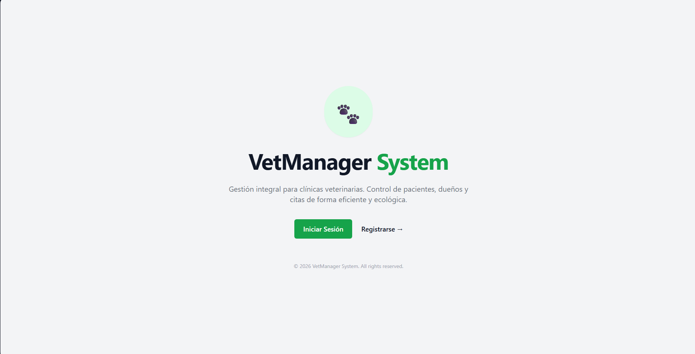

## Descripción

Esta aplicación implementa un sistema integral para clínicas veterinarias. Permite gestionar el ciclo de vida de **Mascotas** (nombre, especie, raza, edad, estado de adopción), sus **Dueños** (datos de contacto) y los **Veterinarios** responsables (especialidad), todo desde un panel de administración elegante con tema oscuro personalizado.

El sistema incluye autenticación con páginas de login y registro personalizadas, un dashboard informativo, y un sidebar/header custom con navegación intuitiva.

---

## Capturas de Pantalla

### 1. Landing Page
Página de bienvenida pública con accesos directos al panel.


### 2. Login Personalizado
Diseño split-screen con panel decorativo y formulario de autenticación.
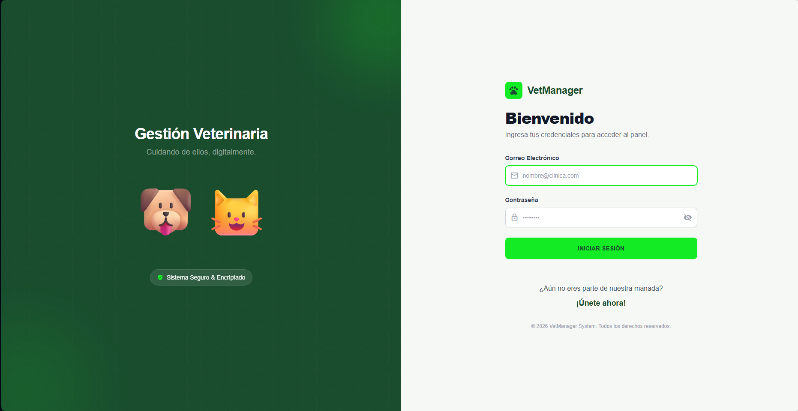

### 3. Registro de Veterinarios
Formulario de registro con diseño a dos columnas y validación en tiempo real.
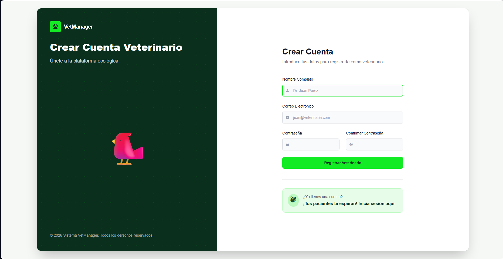

### 4. Dashboard
Panel principal con tarjetas informativas, accesos rápidos y estadísticas del sistema.
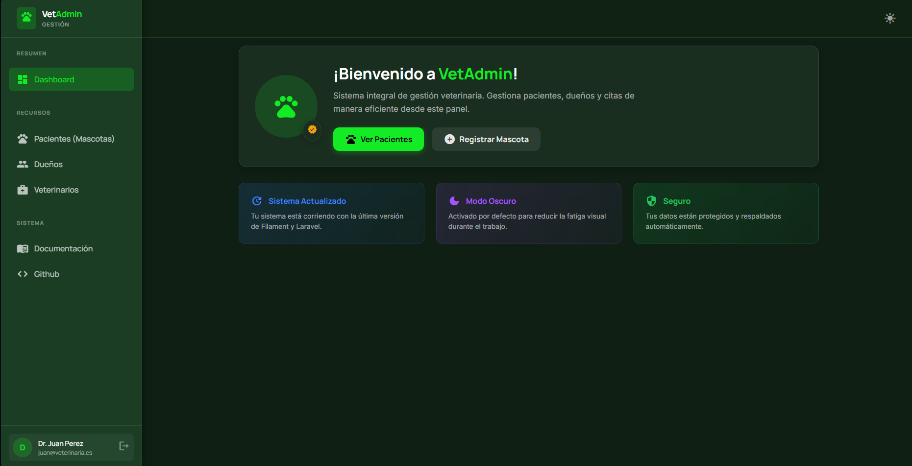

### 5. CRUD de Mascotas
Gestión completa de pacientes con relaciones a dueños y veterinarios.

#### A. Listado de Mascotas
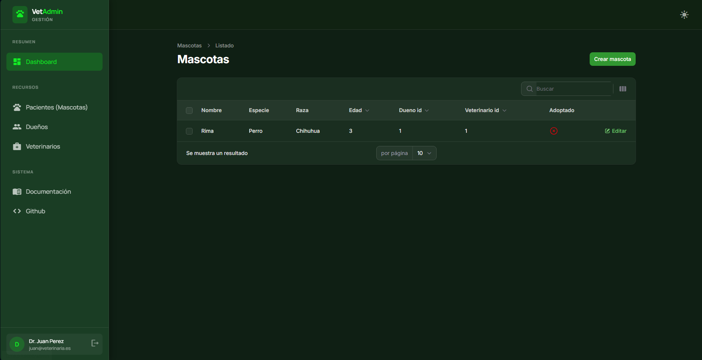

#### B. Crear Mascota
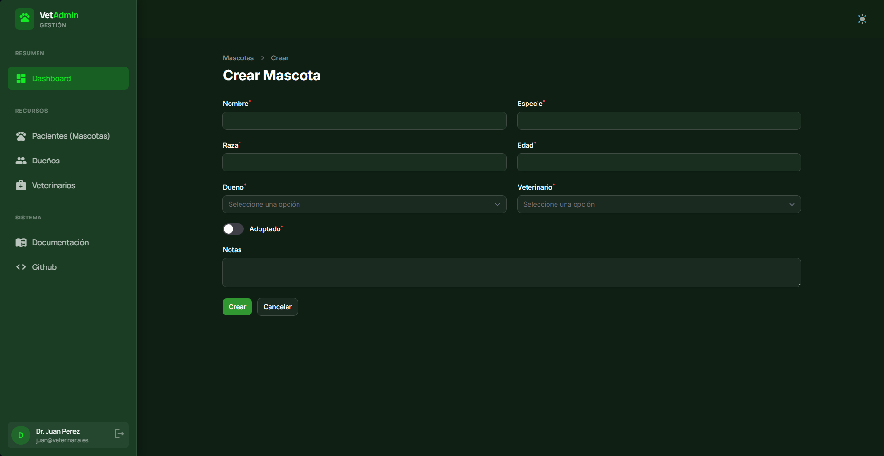

#### C. Editar Mascota
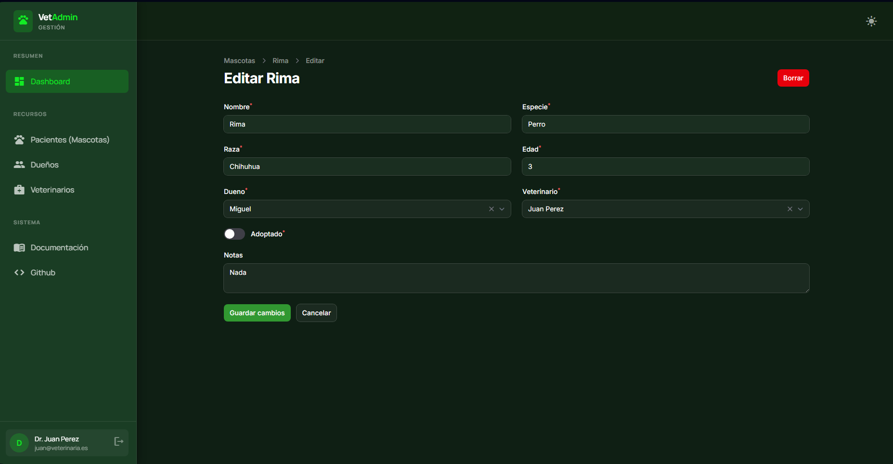

### 6. CRUD de Dueños
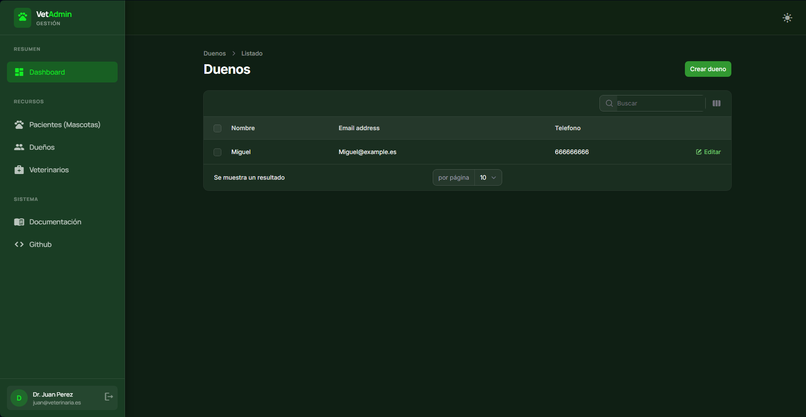

### 7. CRUD de Veterinarios
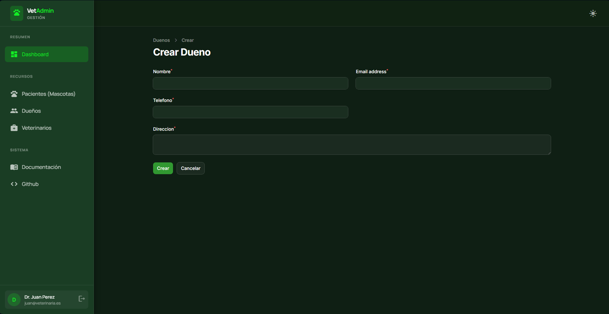

---

## Arquitectura del Proyecto

El proyecto sigue la arquitectura de **FilamentPHP** sobre Laravel, con recursos CRUD auto-generados, páginas personalizadas y un sistema de hooks para inyectar componentes visuales:

```
VetManager-filament/
├── app/
│   ├── Filament/
│   │   ├── Pages/
│   │   │   ├── Auth/
│   │   │   │   ├── CustomLogin.php             # Página de Login personalizada
│   │   │   │   └── CustomRegister.php          # Página de Registro personalizada
│   │   │   └── CustomDashboard.php             # Dashboard personalizado
│   │   ├── Resources/
│   │   │   ├── Mascotas/                       # CRUD Mascotas (List, Create, Edit)
│   │   │   ├── Duenos/                         # CRUD Dueños
│   │   │   └── Veterinarios/                   # CRUD Veterinarios
│   │   └── Widgets/
│   │       └── StatsOverview.php               # Widget de estadísticas
│   ├── Models/
│   │   ├── Mascota.php                         # Modelo con relaciones N:1
│   │   ├── Dueno.php                           # Modelo con relación 1:N
│   │   └── Veterinario.php                     # Modelo con relación 1:N
│   └── Providers/
│       └── Filament/
│           └── AdminPanelProvider.php          # Configuración central del panel
│
├── resources/
│   ├── css/filament/admin/
│   │   └── theme.css                           # Estilos personalizados (auth + sidebar)
│   └── views/
│       ├── filament/
│       │   ├── hooks/
│       │   │   ├── custom-sidebar-overlay.blade.php  # Sidebar personalizado (inline CSS)
│       │   │   └── custom-header-overlay.blade.php   # Header con dark mode toggle
│       │   └── pages/
│       │       ├── auth/
│       │       │   ├── custom-login.blade.php        # Vista split-screen login
│       │       │   └── custom-register.blade.php     # Vista split-screen registro
│       │       └── custom-dashboard.blade.php        # Vista del dashboard
│       └── welcome.blade.php                         # Landing page pública
│
├── database/
│   └── migrations/                             # Estructura de BD
│       ├── create_duenos_table.php
│       ├── create_veterinarios_table.php
│       └── create_mascotas_table.php           # Incluye claves foráneas
│
├── compose.yaml                                # Docker Compose (Sail)
└── .env                                        # Configuración del entorno
```

### Flujo de la Aplicación

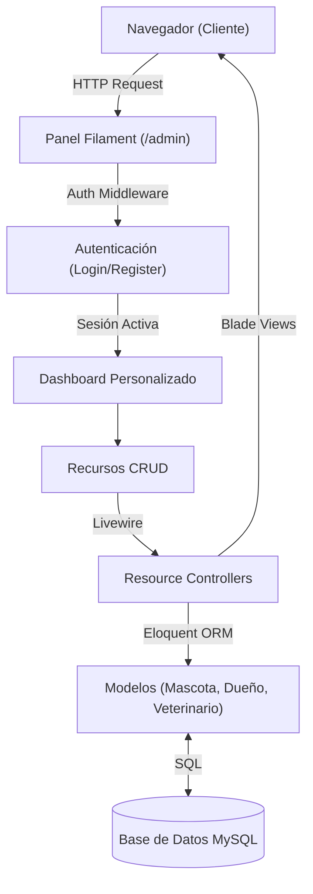

### Modelo Relacional

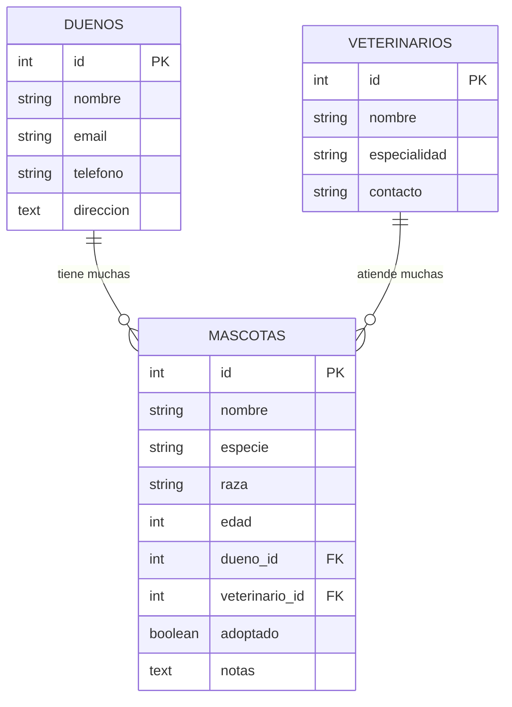

---

## Características Principales

### 1. Panel Administrativo (FilamentPHP)
Framework de administración que genera automáticamente formularios, tablas y páginas CRUD con búsqueda, paginación y filtros.

**Archivo:** `app/Providers/Filament/AdminPanelProvider.php`
> <sub>php</sub>
```php
return $panel
    ->login(CustomLogin::class)
    ->registration(CustomRegister::class)
    ->defaultThemeMode(ThemeMode::Dark)
    ->colors(['primary' => Color::hex('#13ec25')]);
```

### 2. Autenticación Personalizada
Páginas de login y registro con diseño split-screen, panel decorativo y formularios estilizados.

**Archivo:** `app/Filament/Pages/Auth/CustomLogin.php`
> <sub>php</sub>
```php
class CustomLogin extends BaseLogin
{
    protected string $view = 'filament.pages.auth.custom-login';
    public function getHeading(): string { return 'Bienvenido'; }
    public function getSubHeading(): string { return 'Ingresa tus credenciales para acceder al panel.'; }
}
```

### 3. Layout Unificado con Render Hooks
Sidebar y header personalizados inyectados globalmente mediante Filament Render Hooks, usando estilos inline para consistencia.

**Archivo:** `app/Providers/Filament/AdminPanelProvider.php`
> <sub>php</sub>
```php
->renderHook(
    'panels::body.start',
    fn(): string => Blade::render('@include("filament.hooks.custom-sidebar-overlay")')
)
->renderHook(
    'panels::body.start',
    fn(): string => Blade::render('@include("filament.hooks.custom-header-overlay")')
)
```

### 4. Dark Mode por Defecto
Modo oscuro activado desde el arranque con script anti-flash para evitar parpadeos al cargar.

> <sub>javascript</sub>
```javascript
(function(){
    var stored = localStorage.getItem('theme');
    if (stored !== 'light') {
        document.documentElement.classList.add('dark');
        localStorage.setItem('theme', 'dark');
    }
})();
```

### 5. Protección contra Asignación Masiva
Los modelos definen estrictamente la propiedad `$fillable` para evitar modificaciones no autorizadas.

**Archivo:** `app/Models/Mascota.php`
> <sub>php</sub>
```php
protected $fillable = [
    'nombre', 'especie', 'raza', 'edad',
    'dueno_id', 'veterinario_id', 'adoptado', 'notas',
];
```

### 6. Relaciones Eloquent
Modelos conectados con relaciones `hasMany` / `belongsTo` y selects searchables en formularios.

**Archivo:** `app/Filament/Resources/Mascotas/Schemas/MascotaForm.php`
> <sub>php</sub>
```php
Select::make('dueno_id')
    ->relationship('dueno', 'nombre')
    ->searchable()
    ->preload()
    ->required(),
```

---

## Instalación y Despliegue

### 1. Requisitos Previos
*   PHP 8.5+
*   Composer 2.9+
*   Node.js & NPM
*   Servidor MySQL/MariaDB
*   Laragon 6.0 (desarrollo local en Windows)

### 2. Pasos de Instalación
> <sub>bash</sub>
```bash
# 1. Instalar dependencias backend
composer install

# 2. Instalar dependencias frontend
npm install

# 3. Configurar entorno
cp .env.example .env
# (Configura DB_DATABASE=mascotas_db, DB_USERNAME=root, etc)

# 4. Generar clave de aplicación
php artisan key:generate

# 5. Compilar assets
npm run build

# 6. Migrar base de datos
php artisan migrate

# 7. Iniciar servidor de desarrollo
php artisan serve
```

Accede a **http://127.0.0.1:8000** (landing) o **http://127.0.0.1:8000/admin** (panel).

### 3. Despliegue con Docker (Laravel Sail)

> ⚠️ **Requisitos adicionales:** Docker Desktop + WSL2 (Windows)

```bash
# Desde PowerShell (Windows)
wsl bash -c "cd /mnt/c/laragon/www/VetManager-filament && ./vendor/bin/sail up -d"

# Ejecutar migraciones en Docker
wsl bash -c "cd /mnt/c/laragon/www/VetManager-filament && ./vendor/bin/sail artisan migrate --force"

# Detener Docker
wsl bash -c "cd /mnt/c/laragon/www/VetManager-filament && docker compose down -v"
```

> **Nota:** Antes de usar Sail, cambiar en `.env`: `DB_HOST=mysql` y `DB_PASSWORD=password`. Al volver a Laragon: `DB_HOST=127.0.0.1` y `DB_PASSWORD=` (vacío).

---

## Tecnologías Utilizadas

| Tecnología       | Versión | Uso                            |
| :--------------- | :------ | :----------------------------- |
| **Laravel**      | 12.x    | Framework Backend              |
| **FilamentPHP**  | 5.0     | Panel de Administración        |
| **PHP**          | 8.5     | Lenguaje del Servidor          |
| **Livewire**     | 3.x     | Componentes Reactivos          |
| **MySQL**        | 8.4     | Base de Datos Relacional       |
| **Blade**        | -       | Motor de Plantillas            |
| **Tailwind CSS** | 4.x     | Framework CSS (Landing + Auth) |
| **Composer**     | 2.9     | Gestor de Dependencias PHP     |
| **Laravel Sail** | 1.53    | Entorno Docker                 |
| **Docker**       | 24.x+   | Contenedores (Despliegue)      |
| **Laragon**      | 6.0     | Entorno de Desarrollo Local    |
| **phpMyAdmin**   | 5.x     | Gestión de Base de Datos       |

---

## Referencias

- [Documentación Laravel](https://laravel.com/docs)
- [FilamentPHP Documentation](https://filamentphp.com/docs)
- [Laravel Sail](https://laravel.com/docs/sail)
- [Guía Completa del Proyecto (Notion)](https://www.notion.so/Sistema-de-Gesti-n-de-Mascotas-FilamentPHP-303e2f960ea180e3896fd9fa56f648cc)
- [Práctica nº6 - Filament PHP (Enunciado)](https://charmed-group-fc8.notion.site/Pr-ctica-n-6-Filament-PHP-30260ff317c9803491aee1eddf7d8177)
